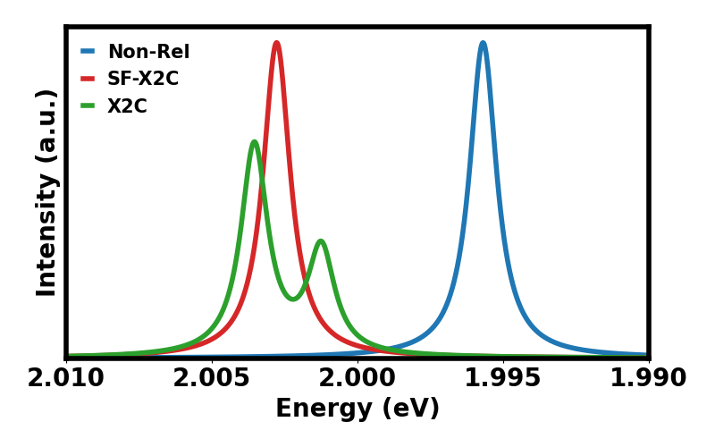

Example of using Gaussian (either GDV_26p  or GDV_j30p) to calculate the Na-D 
Fraunhofer lines: (https://en.wikipedia.org/wiki/Fraunhofer_lines) using 
X2C-CASSCF/X2C-CASCI

3 example systems:
  nonRel: Na with no relativistic effects
  Scalar: Na with X2C, but only scalar terms
  SOC:    Na with full X2C

For each:
  1) Run HF (with indicated Hamiltonian).
  2) Run casscf (9 electrons in 16 [spin] orbitals, 8 roots state average).
  3) Obtain cas ci spectra: (11e,20 orbital, 60 roots).

After running each file (and obtining the formated checkpoint file), the 
`plot_ci.py` script, which uses the [canalyzer](https://github.com/rbeck4/canalyzer.git) 
package, can be used to generate a plot showing the effect of including scalar 
(SF-X2C) and spin-orbit (X2C) terms.

